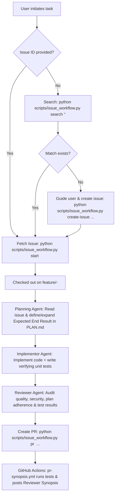

# GitHub Issue-Driven Agentic Workflow

This skill guides agents through the lifecycle of resolving GitHub issues in this repository with strict branch isolation, rigorous definition of expected end results, automated testing, quality/security review, and pull request generation.



---

## 1. Issue Intake & Initiation

When the user gives a prompt or task:
1. **Specific Issue Provided (e.g. "Work on issue #42"):**
   - Fetch the issue and checkout the branch immediately:
     ```powershell
     python scripts/issue_workflow.py start 42
     ```
2. **Task Description Provided (No Issue ID):**
   - Search open issues:
     ```powershell
     python scripts/issue_workflow.py search "<keywords>"
     ```
   - If a matching issue is found, confirm with the user and start:
     ```powershell
     python scripts/issue_workflow.py start <id>
     ```
   - If no matching issue exists, guide the user using the `.github/ISSUE_TEMPLATE/feature_request.md` structure:
     - Formulate Title, Context, Expected End Result (Definition of Done), and Acceptance Criteria.
     - Present the draft issue to the user.
     - Upon confirmation, create the issue:
       ```powershell
       python scripts/issue_workflow.py create-issue --title "feat: ..." --description "..." --end-result "..." --criteria "..."
       ```
     - Start the newly created issue branch with `python scripts/issue_workflow.py start <new_id>`.

---

## 2. Branch Isolation Rule

> [!IMPORTANT]
> Never make changes to `PLAN.md`, source code, or tests on `main`. Branch creation must always precede planning and implementation. The branch name format is strictly `feature/<issue_id>-<sanitized-title>`.

---

## 3. The Three Agent Roles

### Role 1: Planning Agent
- **Trigger:** Immediately after checking out the feature branch.
- **Responsibilities:**
  1. Inspect the issue description and `## Expected End Result (Definition of Done)`.
     - **If the issue defines the end result:** Adopt it and expand it with concrete edge cases and acceptance criteria.
     - **If the issue does NOT define the end result:** Formulate an objective, measurable definition of done.
  2. Update `PLAN.md` with:
     - Issue reference and branch name
     - Expected End Result definition
     - Implementation steps and affected files
     - Verification & test strategy
     - Ensure the `Status:` line in `PLAN.md` is preserved and reflects current work.

### Role 2: Implementor Agent
- **Trigger:** Hand-off from Planning Agent.
- **Responsibilities:**
  1. Read the plan and the formulated Expected End Result.
  2. Implement the feature in source code, configuration, or documentation.
  3. Write automated unit/integration tests that directly prove the Expected End Result has been achieved.
  4. Run the test suite locally:
     ```powershell
     python -m unittest discover -s tests -v
     ```
  5. Verify all tests pass before handing off to the Reviewer Agent.

### Role 3: Reviewer Agent
- **Trigger:** Hand-off from Implementor Agent after tests pass.
- **Responsibilities:**
  1. **Plan & Result Adherence:** Verify the implementation matches the plan and delivers the agreed-upon Expected End Result.
  2. **Code & Markdown Quality:** Ensure code is clean, idiomatic, typed where appropriate, and formatted. Ensure documentation is accurate.
  3. **Security Audit:** Verify no hardcoded secrets, no injection risks, and safe input handling.
  4. **Verification Rigor:** Confirm that test coverage directly checks acceptance criteria and edge cases.
  5. Assemble reviewer feedback into a concise sign-off.

---

## 4. Push & Pull Request Creation

Once the Reviewer Agent approves:
1. Stage and commit all changes (including code, tests, and `PLAN.md`).
2. Run the PR command:
   ```powershell
   python scripts/issue_workflow.py pr <issue_id> `
     --synopsis "Concise summary of changes and architecture" `
     --end-result "Summary of delivered result against the Expected End Result" `
     --verification "Results of running python -m unittest discover -s tests -v"
   ```
3. The command will:
   - Push `feature/<issue_id>-<slug>` to `origin`.
   - Create the GitHub Pull Request populated with the enriched `.github/pull_request_template.md`.

---

## 5. GitHub Actions Reviewer Synopsis

Once the PR is opened:
- The `.github/workflows/pr-synopsis.yml` workflow automatically triggers.
- It executes the test suite, verifies plan guardrails, and renders a formatted **Pull Request Synopsis for Reviewers** in the GitHub Step Summary and as an automated comment on the PR.
